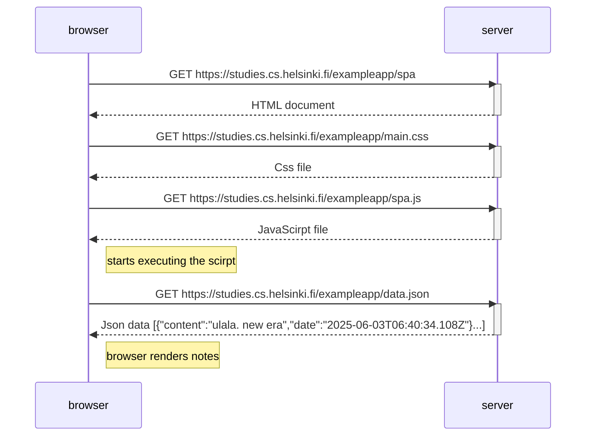

```mermaid
sequenceDiagram
    participant browser
    participant server

    browser->>server:  GET https://studies.cs.helsinki.fi/exampleapp/spa
    activate server
    server-->>browser: HTML document
    deactivate server

    browser->>server:  GET https://studies.cs.helsinki.fi/exampleapp/main.css
    activate server
    server-->>browser: Css file
    deactivate server

    browser->>server: GET https://studies.cs.helsinki.fi/exampleapp/spa.js
    activate server
    server-->>browser: JavaScirpt file
    deactivate server

    Note right of browser: starts executing the scirpt

    browser->>server: GET https://studies.cs.helsinki.fi/exampleapp/data.json
    activate server
    server-->>browser: Json data [{"content":"ulala. new era","date":"2025-06-03T06:40:34.108Z"}...]
    deactivate server

    Note right of browser: browser renders notes
```
