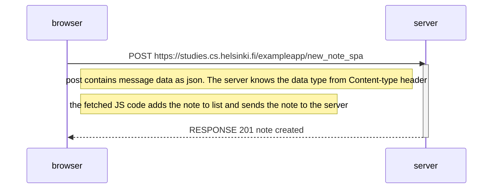

```mermaid
sequenceDiagram
    participant browser
    participant server

    browser->>server: POST https://studies.cs.helsinki.fi/exampleapp/new_note_spa
    activate server
    Note right of browser: post contains message data as json. The server knows the data type from Content-type header
    Note right of browser: the fetched JS code adds the note to list and sends the note to the server
    server-->>browser: RESPONSE 201 note created
    deactivate server
```
